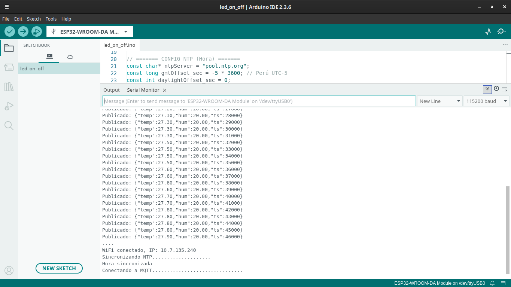
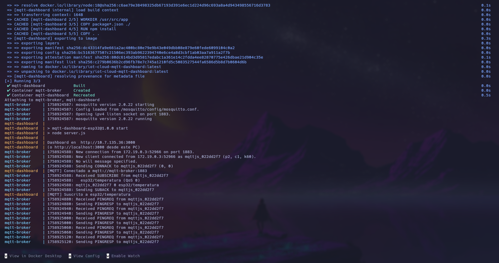
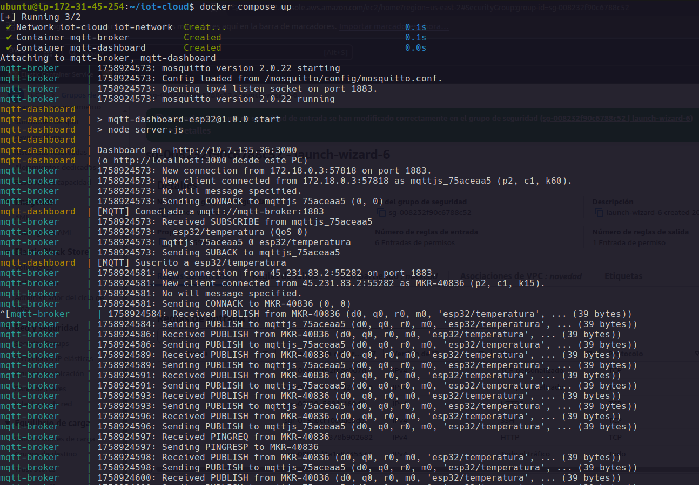
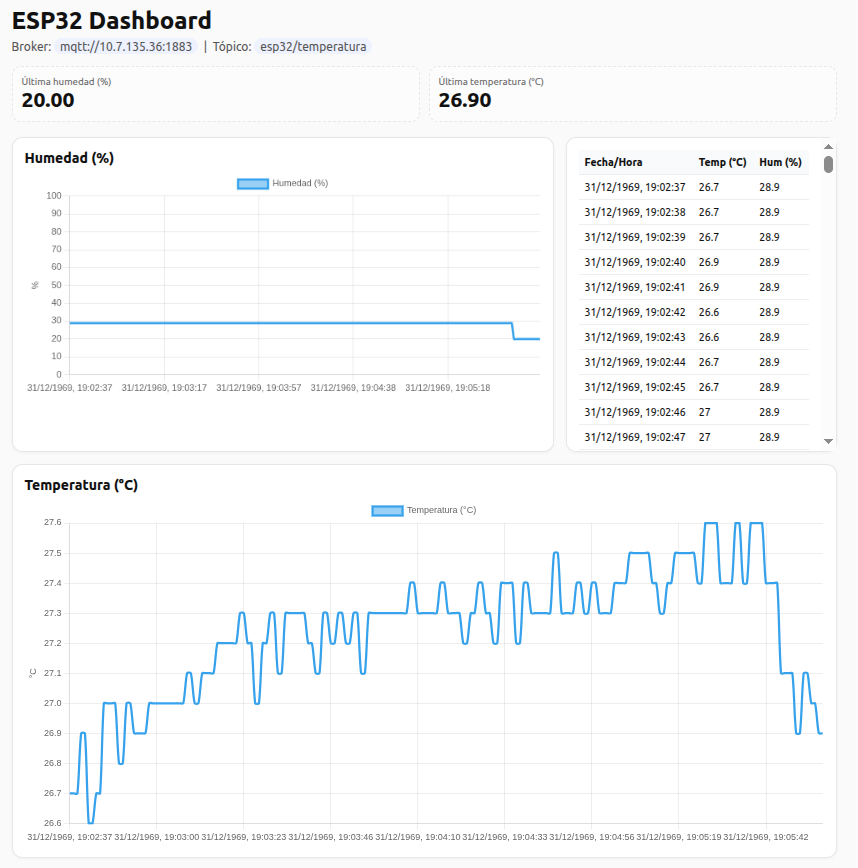
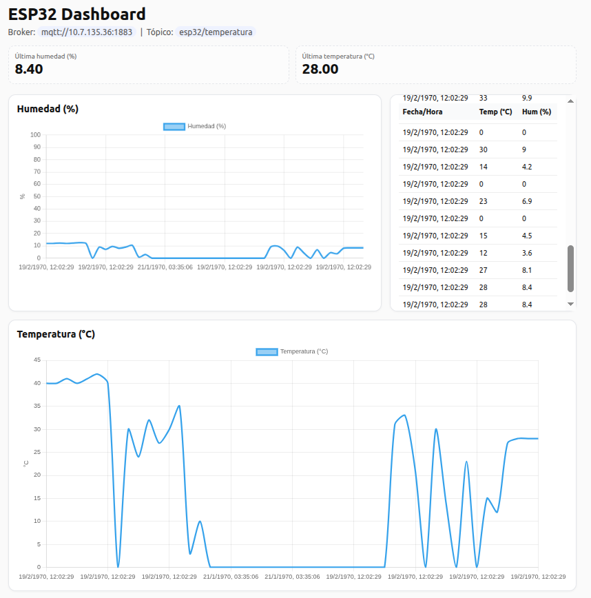

# Visualización Analítica de Métricas de Humedad y Temperatura en Tiempo Real

**Autores**

- Braulio Nayap Maldonado Casilla
- Sergio Daniel Mogollon Caceres
- Paul Antony Parizaca Mozo
- Avelino Lupo Condori
- Leon Felipe Davis Coropuna
- Aldo Raul Martinez Choque

Este proyecto implementa un sistema de **adquisición y visualización en tiempo real** de métricas de humedad y temperatura provenientes de sensores IoT.
Los datos son capturados mediante dispositivos **ESP32 con DHT11** o **Arduino MKR IoT Carrier**, transmitidos vía **MQTT**, y presentados en una interfaz que permite el monitoreo continuo de las condiciones ambientales.

## Código de Dispositivos IoT

### **ESP32 + DHT11**

Se cargó el siguiente código en el **ESP32**, con el cual se leyeron datos de **temperatura y humedad** mediante un sensor **DHT11**, se sincronizó la hora a través de **NTP** y se envió la información a un **broker MQTT** en formato JSON.

- **Configuración de credenciales y parámetros**
  Se definen:

  - Credenciales de **WiFi** y **broker MQTT**.
  - Pin y tipo de sensor **DHT**.
  - Servidor y zona horaria para sincronización **NTP**.

  ```cpp
  // WiFi
  const char *WIFI_SSID = "wifi";
  const char *WIFI_PASS = "password";

  // MQTT
  const char *MQTT_BROKER = "IP";
  const int   MQTT_PORT   = 1883;
  const char *MQTT_TOPIC  = "esp32/temperatura";

  // Sensor DHT
  #define DHTPIN 26
  #define DHTTYPE DHT11
  DHT dht(DHTPIN, DHTTYPE);

  // NTP
  const char *ntpServer = "pool.ntp.org";
  const long gmtOffset_sec    = -5 * 3600;
  const int  daylightOffset_sec = 0;
  ```

- **Objetos de comunicación y variables**

  - `espClient` y `mqtt` gestionan la conexión MQTT.
  - `INTERVAL_MS` define el intervalo de envío de datos (1 s).
  - `lastPublish` almacena el momento del último envío.

  ```cpp
  WiFiClient espClient;
  PubSubClient mqtt(espClient);

  unsigned long lastPublish = 0;
  const unsigned long INTERVAL_MS = 1000;
  ```

- **Conexión a WiFi**
  Intenta conectarse a la red y muestra la **IP local** una vez establecida la conexión.

  ```cpp
  void connectWiFi() {
  Serial.print("Conectando a WiFi");
  WiFi.begin(WIFI_SSID, WIFI_PASS);
  while (WiFi.status() != WL_CONNECTED) {
      delay(500);
      Serial.print(".");
  }
  Serial.print("\nWiFi conectado, IP: ");
  Serial.println(WiFi.localIP());
  }
  ```

- **Sincronización de hora (NTP)**

  Solicita la hora actual a `pool.ntp.org` y espera hasta recibir un **timestamp válido**, necesario para enviar datos con marca de tiempo.

  ```cpp
  void initTime() {
  configTime(gmtOffset_sec, daylightOffset_sec, ntpServer);
  Serial.print("Sincronizando NTP");
  time_t now = 0;
  int retries = 0;
  while (now < 1700000000 && retries < 20) {
      delay(500);
      Serial.print(".");
      now = time(nullptr);
      retries++;
  }
  Serial.println("\nHora sincronizada");
  }
  ```

- **Conexión al broker MQTT**

  Configura el servidor MQTT y mantiene la reconexión hasta que el ESP32 esté suscrito.

  ```cpp
  void connectMQTT() {
  mqtt.setServer(MQTT_BROKER, MQTT_PORT);
  Serial.print("Conectando a MQTT");
  while (!mqtt.connected()) {
      String clientId = "ESP32-" + String((uint32_t)ESP.getEfuseMac(), HEX);
      if (mqtt.connect(clientId.c_str())) {
      Serial.println("\nMQTT conectado");
      } else {
      Serial.print(".");
      delay(1000);
      }
  }
  }
  ```

- **Inicialización**

  - Inicia el puerto serial, el sensor DHT, WiFi, NTP y MQTT.
  - Se ejecuta una sola vez al encender el dispositivo.

  ```cpp
  void setup() {
  Serial.begin(115200);
  dht.begin();
  connectWiFi();
  initTime();
  connectMQTT();
  }
  ```

- **Función principal**

  1. Revisa y reconecta WiFi/MQTT si es necesario.
  2. Cada segundo:

  - Lee **temperatura y humedad**.
  - Obtiene la **hora actual en milisegundos**.
  - Crea un mensaje JSON con las variables.
  - Publica el mensaje en el **tópico MQTT** configurado.

  ```cpp
  void loop() {
  if (WiFi.status() != WL_CONNECTED) connectWiFi();
  if (!mqtt.connected()) connectMQTT();
  mqtt.loop();

  unsigned long nowMs = millis();
  if (nowMs - lastPublish >= INTERVAL_MS) {
      lastPublish = nowMs;

      float h = dht.readHumidity();
      float t = dht.readTemperature();

      if (isnan(h) || isnan(t)) {
      Serial.println("Error al leer el DHT");
      return;
      }

      unsigned long ts = (unsigned long)time(nullptr) * 1000UL;
      char payload[128];
      snprintf(payload, sizeof(payload),
              "{\"temp\":%.2f,\"hum\":%.2f,\"ts\":%lu}",
              t, h, ts);

      if (mqtt.publish(MQTT_TOPIC, payload)) {
      Serial.print("Publicado: ");
      Serial.println(payload);
      } else {
      Serial.println("Error publicando en MQTT");
      }
  }
  }
  ```

- **Ejecución**

  

  - **temp**: temperatura en °C

  - **hum**: humedad relativa en %

  - **ts**: marca de tiempo en milisegundos desde 1970 (UNIX epoch)

### **Arduino MKR IoT Carrier – Sensor de Humedad**

Este programa permite que un **Arduino MKR WiFi** con **IoT Carrier** lea el nivel de **humedad del suelo** mediante un sensor analógico, obtenga la hora con **NTP** y envíe los datos a un **broker MQTT**. Además, muestra la información en la **pantalla integrada** del carrier.

- **Configuración de red, MQTT y hardware**

  Define credenciales de **WiFi**, parámetros de **MQTT**, servidor **NTP** y pin analógico donde se conecta el sensor de humedad.

  ```cpp
  // WiFi
  const char *WIFI_SSID = "wifi";
  const char *WIFI_PASS = "password";

  // MQTT
  const char *MQTT_BROKER = "IP";
  const int   MQTT_PORT   = 1883;
  const char *MQTT_TOPIC  = "mkr/humedad";

  // NTP
  const char *ntpServer   = "pool.ntp.org";
  const long  gmtOffset_sec = -5 * 3600;

  // Hardware
  MKRIoTCarrier carrier;
  const int pinSensor = A6;
  ```

- **Objetos de comunicación**

  - `mqtt` usa `wifiClient` para enviar datos.
  - `timeClient` consulta la hora cada 60 segundos.

  ```cpp
  WiFiClient wifiClient;
  PubSubClient mqtt(wifiClient);
  WiFiUDP ntpUDP;
  NTPClient timeClient(ntpUDP, ntpServer, gmtOffset_sec, 60000);
  ```

- **Variables de control**

  - Controla el intervalo de publicación en MQTT.

  ```cpp
  unsigned long lastPublish = 0;
  const unsigned long INTERVAL_MS = 2000;
  ```

- **Conexión a WiFi**

  Intenta conectarse a la red y muestra la IP asignada.
  Reintenta en caso de timeout.

  ```cpp
  void connectWiFi() {
  Serial.print("Conectando a WiFi");
  WiFi.begin(WIFI_SSID, WIFI_PASS);
  unsigned long start = millis();
  while (WiFi.status() != WL_CONNECTED) {
      delay(500);
      Serial.print(".");
      if (millis() - start > 20000) {
      Serial.println("\nTimeout WiFi, reintentando...");
      start = millis();
      }
  }
  Serial.print("\nWiFi conectado, IP: ");
  Serial.println(WiFi.localIP());
  }
  ```

- **Conexión al broker MQTT**

  Configura el servidor MQTT y mantiene la reconexión automática.

  ```cpp
  void connectMQTT() {
  mqtt.setServer(MQTT_BROKER, MQTT_PORT);
  Serial.print("Conectando a MQTT");
  while (!mqtt.connected()) {
      String clientId = "MKR-" + String(millis());
      if (mqtt.connect(clientId.c_str())) {
      Serial.println("\nMQTT conectado");
      } else {
      Serial.print(".");
      delay(1000);
      }
  }
  }
  ```

- **Sincronización de hora (NTP)**

  Obtiene la hora actual en segundos desde 1970.
  Reintenta hasta 20 veces para asegurar la sincronización.

  ```cpp
  void initTime() {
  timeClient.begin();
  Serial.print("Sincronizando NTP");
  int retries = 0;
  while (timeClient.getEpochTime() < 1600000000UL && retries < 20) {
      timeClient.update();
      delay(500);
      Serial.print(".");
      retries++;
  }
  if (timeClient.getEpochTime() >= 1600000000UL)
      Serial.println("\nHora sincronizada (NTP).");
  else
      Serial.println("\nNo se pudo sincronizar hora (NTP).");
  }
  ```

- **Inicialización del dispositivo**

  - Configura el puerto serial y el IoT Carrier.
  - Conecta WiFi, sincroniza hora y conecta MQTT.
  - Muestra un mensaje de inicio en la pantalla.

  ```cpp
  void setup() {
  Serial.begin(115200);
  CARRIER_CASE = true;
  carrier.begin();
  connectWiFi();
  initTime();
  connectMQTT();

  carrier.display.fillScreen(ST77XX_BLACK);
  carrier.display.setTextSize(2);
  carrier.display.setTextColor(ST77XX_WHITE);
  carrier.display.setCursor(20, 60);
  carrier.display.print("Iniciando...");
  delay(1500);
  }
  ```

- **Función principal**

  1. Verifica las conexiones WiFi y MQTT.
  2. Actualiza la hora con NTP.
  3. Cada 2 segundos:

  - **Lee el sensor de humedad** (en %).
  - Calcula la humedad equivalente en **g/m³**.
  - Clasifica el estado (`Seco`, `Humedo`, `Muy humedo`).
  - Publica un **JSON** con la lectura y la marca de tiempo.
  - Actualiza la **pantalla** del carrier.

  ```cpp
  void loop() {
  if (WiFi.status() != WL_CONNECTED) connectWiFi();
  if (!mqtt.connected()) connectMQTT();
  mqtt.loop();
  timeClient.update();

  unsigned long nowMs = millis();
  if (nowMs - lastPublish >= INTERVAL_MS) {
      lastPublish = nowMs;

      int valor = analogRead(pinSensor);
      int humedad = map(valor, 1023, 200, 0, 100);
      humedad = constrain(humedad, 0, 100);

      float humedad_gm3 = humedad * 30.0 / 100.0;

      String estado;
      if (humedad < 30)      estado = "Seco";
      else if (humedad < 70) estado = "Humedo";
      else                   estado = "Muy humedo";

      unsigned long ts_sec = timeClient.getEpochTime();

      char payload[160];
      snprintf(payload, sizeof(payload),
              "{\"temp\":%d,\"hum\":%.2f,\"ts\":%lu}",
              humedad, humedad_gm3, ts_sec);

      if (mqtt.publish(MQTT_TOPIC, payload)) {
      Serial.print("Publicado: ");
      Serial.println(payload);
      } else {
      Serial.println("Error publicando en MQTT");
      }

      carrier.display.fillScreen(ST77XX_BLACK);
      carrier.display.setTextSize(2);
      carrier.display.setTextColor(ST77XX_WHITE);
      carrier.display.setCursor(20, 20);
      carrier.display.print("Humedad suelo:");
      carrier.display.setCursor(40, 60);
      carrier.display.print(humedad);
      carrier.display.print(" %");
      carrier.display.setCursor(40, 90);
      carrier.display.print(humedad_gm3, 1);
      carrier.display.print(" g/m3");
      carrier.display.setCursor(40, 120);
      carrier.display.print(estado);
  }
  }
  ```

- **Ejecución**

  ```json
  { "temp": 45, "hum": 13.5, "ts": 1706482000 }
  ```

  - **temp**: humedad (%) medida por el sensor analógico.
  - **hum**: estimación de humedad en g/m³.
  - **ts**: marca de tiempo (epoch en segundos).

---

## MQTT

Es el puente de comunicación entre los **dispositivos IoT (ESP32, MKR, etc.)** y el **servidor web/dashboard**.

- **Dispositivos** (por ejemplo, MKR IoT Carrier):

  - Publican mensajes en un _topic_ (`mkr/humedad` o `esp32/temperatura`).
  - Los mensajes contienen datos en formato JSON: humedad, temperatura, timestamp, etc.

- **Broker MQTT**:

  - Es el “centro de mensajes” (puede ser Mosquitto, EMQX, etc.).
  - Recibe las publicaciones de los nodos IoT y las distribuye a todos los clientes suscritos a los mismos _topics_.

- **Servidor Node.js**:

  - Se **suscribe** al _topic_ para recibir las lecturas.
  - Procesa los datos y los envía en tiempo real a los navegadores mediante **Socket.IO** (websockets).
  - Ofrece una **API HTTP** para consultar lecturas históricas.

Esto permite que el dashboard muestre las mediciones **en vivo**, sin que el navegador tenga que estar preguntando constantemente.

### **Servidor**

- **Configuración MQTT**

  - URL del broker MQTT (puede ser un contenedor Docker o IP local).
  - Credenciales de usuario/contraseña (si el broker las requiere).
  - _Topic_ al que el servidor se suscribe para recibir los datos de los sensores.

  ```js
  const MQTT_URL = process.env.MQTT_URL || "mqtt://mqtt-broker:1883";
  const MQTT_USER = process.env.MQTT_USER || "";
  const MQTT_PASS = process.env.MQTT_PASS || "";
  const MQTT_TOPIC = process.env.MQTT_TOPIC || "esp32/temperatura";
  ```

- **Creación del servidor HTTP y Socket.IO**

  - **app**: instancia de Express para manejar las rutas HTTP.
  - **server**: servidor HTTP que también usará Socket.IO.
  - **io**: instancia de Socket.IO que permite emitir eventos en tiempo real.

  ```js
  const app = express();
  const server = http.createServer(app);
  const io = new SocketIOServer(server, { cors: { origin: "*" } });
  ```

- **Memoria de lecturas**

  - Guarda hasta **200 lecturas recientes** en memoria.
  - Si se excede el límite, elimina la más antigua (`shift()`).

  ```js
  const MAX_READINGS = 200;
  const readings = []; // { ts, temp, hum, raw }
  const pushReading = (r) => {
    readings.push(r);
    if (readings.length > MAX_READINGS) readings.shift();
  };
  ```

- **Conexión al broker MQTT**

  Crea un cliente que se conecta al broker con las credenciales configuradas.

  ```js
  const mqttClient = mqtt.connect(MQTT_URL, {
    username: MQTT_USER || undefined,
    password: MQTT_PASS || undefined,
  });
  ```

- **Eventos de MQTT**

  - Al conectarse, se **suscribe al topic** para recibir mensajes de los sensores.

    ```js
    mqttClient.on("connect", () => {
      console.log("[MQTT] Conectado a", MQTT_URL);
      mqttClient.subscribe(MQTT_TOPIC, (err) => {
        if (err) console.error("[MQTT] Error suscripción:", err.message);
        else console.log(`[MQTT] Suscrito a ${MQTT_TOPIC}`);
      });
    });
    ```

  - Maneja errores de conexión.

    ```js
    mqttClient.on("error", (err) =>
      console.error("[MQTT] Error:", err.message)
    );
    ```

  - Cada vez que llega un mensaje:

    1. Lo **parsea** como JSON.
    2. Valida los campos (`temp`, `hum`, `ts`).
    3. Lo guarda en `readings`.
    4. Lo **emite por websockets** a todos los navegadores conectados.

    ```js
    mqttClient.on("message", (_topic, payload) => {
      try {
        const data = JSON.parse(payload.toString());
        const reading = {
          ts: Number.isFinite(data.ts) ? data.ts : Date.now(),
          temp: typeof data.temp === "number" ? data.temp : null,
          hum: typeof data.hum === "number" ? data.hum : null,
          raw: data,
        };
        pushReading(reading);
        io.emit("reading", reading); // broadcast en tiempo real
      } catch (e) {
        console.warn("[MQTT] Mensaje inválido:", payload.toString());
      }
    });
    ```

- **Rutas HTTP**

  - Sirve los archivos estáticos del directorio `public` (HTML, JS, CSS del dashboard).
  - API `/api/readings`: devuelve las últimas lecturas en formato JSON (útil para histórico o debug).

  ```js
  app.use(express.static(path.join(__dirname, "public")));
  app.get("/api/readings", (_req, res) => res.json(readings));
  ```

- **Inicio del servidor**

  - Levanta el servidor en el puerto 3000 (por defecto).
  - Muestra la URL para acceder al dashboard.

  ```js
  const PORT = process.env.PORT || 3000;
  server.listen(PORT, () => {
    console.log(`Dashboard en  http://10.7.135.36:${PORT}`);
    console.log(`(o http://localhost:${PORT} desde este PC)`);
  });
  ```

---

## **Ejecución**

### Ejecución local

1. **Clonar el repositorio**

   ```bash
   git clone https://github.com/PaulParizacaMozo/iot-cloud.git
   cd iot-cloud/mqtt-dashboard
   ```

2. **Instalar dependencias**

   ```bash
   npm install
   ```

3. **Configurar variables de entorno**

   - Crear un archivo `.env` o exportar variables antes de iniciar:

     ```bash
     export MQTT_URL=mqtt://<IP_BROKER>:1883
     export MQTT_TOPIC=esp32/temperatura
     ```

   - Si el broker corre en tu LAN, reemplaza `<IP_BROKER>` con su dirección.

4. **Iniciar el servidor**

   ```bash
   npm run start
   ```

   

   - El dashboard estará disponible en [http://localhost:3000](http://localhost:3000)

### Despliegue con **Docker Compose**

La solución incluye un `Dockerfile` para el servidor **Node.js** y un `docker-compose.yml` que levanta automáticamente **dos servicios** dentro de una misma red:

- **`mqtt-broker`** → Broker MQTT basado en **Eclipse Mosquitto**.
- **`mqtt-dashboard`** → Servidor **Node.js/Socket.IO** que sirve el dashboard web y retransmite las lecturas.

#### Pasos

1. **Ubicarse en la carpeta raíz del proyecto**

   ```bash
   cd iot-cloud
   ```

2. **Construir e iniciar los contenedores**

   ```bash
   docker compose up --build
   ```

3. **Acceder a los servicios**

   - **Dashboard web:** [http://localhost:3000](http://localhost:3000)
   - **Broker MQTT (para ESP32/MKR):**
     `mqtt://<IP_HOST>:1883`
     _(o `mqtt://mqtt-broker:1883` si se conecta desde otro contenedor en la misma red Docker)_

- **Ejemplo de despliegue en la nube**
  En este proyecto se realizó una prueba en **Amazon EC2**, obteniendo el siguiente resultado en la consola del servidor:

  

---

## **Dashboard**

Una vez iniciado el **dashboard** (localmente o en Docker), conecta los dispositivos IoT para comenzar a recibir y visualizar los datos en tiempo real.

### Conexión de dispositivos

- **ESP32 + DHT11**
  Dispositivo midiendo temperatura y humedad, y enviando los datos por MQTT.
  

- **Arduino MKR IoT Carrier**
  Dispositivo midiendo humedad de suelo y transmitiendo vía MQTT.
  

### Visualización en tiempo real

Después de que los dispositivos estén conectados y publicando datos, el dashboard web mostrará las métricas de manera continua:

- **ESP32 + DHT11**
  Lecturas de **temperatura** y **humedad ambiente**.
  

- **Arduino MKR IoT Carrier**
  Lecturas de **humedad del suelo** y conversión en g/m³.
  

---

## Author

- **Braulio Nayap Maldonado Casilla** - [GitHub Profile](https://github.com/ShinjiMC)
- **Sergio Daniel Mogollon Caceres** - [GitHub Profile](https://github.com/i-am-sergio)
- **Paul Antony Parizaca Mozo** - [GitHub Profile](https://github.com/PaulParizacaMozo)
- **Avelino Lupo Condori** - [GitHub Profile](https://github.com/lino62U)
- **Leon Felipe Davis Coropuna** - [GitHub Profile](https://github.com/LeonDavisCoropuna)
- **Aldo Raul Martinez Choque** - [GitHub Profile](https://github.com/ALdoMartineCh16)

## License

This project is licensed under the MIT License. See the [LICENSE](LICENSE) file for details.
